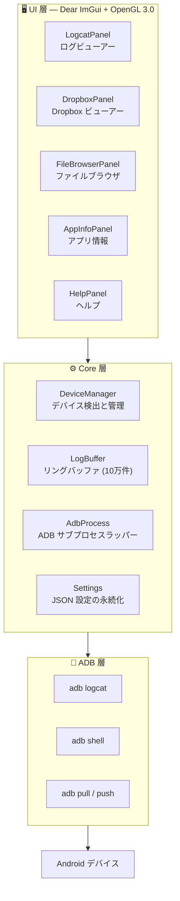

[English](README.md) | [簡体中文](README.zh-Hans.md) | [繁體中文](README.zh-Hant.md) | **日本語** | [한국어](README.ko.md) | [Русский](README.ru.md) | [Português (BR)](README.pt-BR.md)

<p align="center">
  
</p>

<h1 align="center">LogCater</h1>

<p align="center">
  <b>Android デバイスのログ・ファイル管理デスクトップツール</b>
</p>

<p align="center">
  <a href="../../releases"></a>
  <a href="../../releases"></a>
  <a href="LICENSE"></a>
  
  
  <a href="../../stargazers"></a>
</p>

---

## 目次

- [概要](#概要)
- [機能](#機能)
  - [リアルタイム Logcat](#リアルタイム-logcat)
  - [Dropbox ビューアー](#dropbox-ビューアー)
  - [ファイルブラウザ](#ファイルブラウザ)
  - [アプリ情報](#アプリ情報)
  - [プロセス名マッピング](#プロセス名マッピング)
  - [UI スケーリング](#ui-スケーリング)
  - [自動アップデートチェック](#自動アップデートチェック)
- [ダウンロードとインストール](#ダウンロードとインストール)
- [ソースからビルド](#ソースからビルド)
- [アーキテクチャ概要](#アーキテクチャ概要)
- [ショートカット](#ショートカット)
- [FAQ](#faq)
- [コントリビューション](#コントリビューション)
- [謝辞](#謝辞)
- [ライセンス](#ライセンス)

## 概要

LogCater は Windows 向けのデスクトップツールで、Android 開発者に統合的なデバイスログ表示、ファイル管理、アプリ情報ブラウジングを提供します。

- **依存ゼロで動作** — Android SDK や JDK のインストール不要。ADB はリリースパッケージに同梱
- **リアルタイムストリーミングログ** — 永続的な `adb logcat` 接続、テキスト / Tag / Level の 3 次元フィルタに対応
- **軽量・高性能** — Dear ImGui + OpenGL 3.0 で構築。高速起動、低メモリ使用量、仮想スクロールで大量ログに対応
- **完全オープンソース** — MIT ライセンス、コードは完全公開

## 機能

### リアルタイム Logcat

`adb logcat -v threadtime` の出力をストリーミング取得し、**テキストキーワード**、**Tag**、**Level** の 3 次元フィルタを提供します。Tag 入力は履歴を自動記録し、フィルタ設定は永続化されます。

- 自動スクロール / 手動スクロール / 一時停止 / 再開
- 任意のログ行をクリックで詳細パネルを表示（タイムスタンプ、PID、TID、Tag、完全な生ログ行）
- 行内にプロセス名を自動表示
- ログレベルごとのカラー識別子

### Dropbox ビューアー

デバイスの `dumpsys dropbox` エントリ（クラッシュレポート、ANR、WTF など）を閲覧します。

- タイプ別フィルタ（System / Data / Crash）
- クリックで詳細ポップアップ表示
- ワンクリックでローカルファイルにエクスポート

### ファイルブラウザ

デスクトップから離れずに、デバイスファイルを完全管理できます。

- パッケージセレクタでアプリのプライベートディレクトリに素早く移動
- クイックナビゲーション：`/sdcard`、アプリデータディレクトリ、`files`、`cache`
- **アップロード** — Windows エクスプローラーからファイルをドラッグ＆ドロップでデバイスに転送
- **ダウンロード** — ボタンクリックでファイルをローカルに取得
- **プレビュー** — logcat / UE4 ログのシンタックスハイライト対応ファイルプレビュー
- **ブックマーク** — 最大 20 個のディレクトリブックマーク（セッション間で保持）

### アプリ情報

インストール済みアプリの詳細情報を表示します。

- サードパーティ / システム / すべて の 3 種類のフィルタ
- テーブル表示：アプリ名、パッケージ名、バージョン名、バージョンコード、Target SDK
- 行クリックでパッケージ名をクリップボードにコピー
- パッケージ名またはアプリ名で検索可能

### プロセス名マッピング

ログ行の PID を対応するプロセス名に自動解決します。手動 `ps | grep` は不要です。

### UI スケーリング

Ctrl + マウスホイール、Ctrl + 0/+/- でリアルタイムズーム。倍率は `%APPDATA%\LogCater\settings.json` に保存され、次回起動時に自動復元されます。

### 自動アップデートチェック

起動時に GitHub Releases に自動問い合わせし、新しいバージョンの有無を確認します。

## ダウンロードとインストール

[Releases](../../releases) ページから最新の `LogCater.zip` をダウンロードし、任意のディレクトリに展開して `logcater.exe` を実行してください。ADB は同梱されているため、別途インストール不要です。

> ⚠️ **Windows Defender の誤検知について**
>
> LogCater は**完全なオープンソースであり、悪意のあるコードは一切含まれていません**。コード署名を行っていないため、Windows Defender が疑わしいプログラムとしてフラグを立てる場合があります。
>
> **解決策：**
> - Windows Defender の除外リストに `logcater.exe` を追加
> - または[ソースからビルド](#ソースからビルド)（未署名の自前ビルドは通常フラグされません）

## ソースからビルド

### 前提条件

| ツール | バージョン |
|---|---|
| Visual Studio (MSVC) | 2022+ |
| CMake | 3.21+ |
| Git | 任意 |

### 依存ライブラリ

すべてのサードパーティライブラリは CMake `FetchContent` により自動ダウンロードされます。**手動インストール不要**：

| ライブラリ | バージョン | 用途 |
|---|---|---|
| [GLFW](https://github.com/glfw/glfw) | 3.4 | ウィンドウ管理、OpenGL コンテキスト |
| [Dear ImGui](https://github.com/ocornut/imgui) | v1.91.9 | 即時モード GUI |
| [nlohmann/json](https://github.com/nlohmann/json) | v3.11.3 | JSON パース（設定永続化用） |

### コンパイル

```bash
cmake -B build -DCMAKE_BUILD_TYPE=Release
cmake --build build --config Release
```

またはリポジトリルートの `go.bat` を実行（MSVC 環境を自動設定してビルドします）。

## アーキテクチャ概要



すべての ADB 通信はバックグラウンドスレッドで実行され、UI スレッドはフレームごとに完了状態をポーリングします。これにより UI は常に応答性を保ちます。

`LogBuffer` は読み取り/書き込みロックで保護されており、高頻度の書き込み（logcat ストリーム）と読み取り（フィルタ更新）の並行アクセスをサポートします。

## ショートカット

| ショートカット | 機能 |
|---|---|
| Ctrl + ホイール上 | UI を拡大 |
| Ctrl + ホイール下 | UI を縮小 |
| Ctrl + = | UI を拡大 |
| Ctrl + - | UI を縮小 |
| Ctrl + 0 | ズームを 100% にリセット |
| Space | ログスクロールの一時停止 / 再開 |
| Home | ログの先頭にジャンプ |
| End | ログの末尾にジャンプ |

## FAQ

<details>
<summary><b>ADB がデバイスに接続できません</b></summary>

1. スマートフォンで **USB デバッグ** が有効になっていることを確認（開発者オプション内）
2. USB ケーブルがデータ転送に対応していることを確認（充電専用ケーブルではないこと）
3. 端末で `adb devices` を実行してデバイス認識状態を確認
4. USB の抜き差しか `adb kill-server && adb start-server` を試す
</details>

<details>
<summary><b>Logcat のログが文字化けする、または不完全です</b></summary>

一部のメーカー ROM は logcat に非標準エンコーディングの文字を出力する場合があります。LogCater は UTF-8 でログ行を解析し、デコードできない文字はスキップします。正常なログの表示には影響しません。
</details>

<details>
<summary><b>Windows Defender がウイルスとしてマークするのはなぜですか？</b></summary>

LogCater は高価なコード署名証明書（通常 $200-400/年）を購入していません。Windows Defender は未署名の新しいプログラムに対して「疑わしきは罰する」戦略を取ります。ソースからビルドしたプログラムは通常フラグされません。Defender がソースからのビルド行為を正当なものと見なすためです。

詳細は[ダウンロードとインストール](#ダウンロードとインストール)の解決策を参照してください。
</details>

<details>
<summary><b>ADB のパスをカスタマイズするには？</b></summary>

システムに Android SDK がインストールされている場合、LogCater は `%LOCALAPPDATA%\Android\Sdk\platform-tools\adb.exe` を自動検出します。手動で指定する場合は、`%APPDATA%\LogCater\settings.json` の `adbPath` フィールドを編集してください。
</details>

## コントリビューション

バグ報告や機能提案の Issue、PR を歓迎します。

1. このリポジトリを Fork
2. フィーチャーブランチを作成 (`git checkout -b feature/amazing-feature`)
3. 変更をコミット (`git commit -m 'Add amazing feature'`)
4. ブランチにプッシュ (`git push origin feature/amazing-feature`)
5. Pull Request を作成

貢献の方向性：
- macOS / Linux へのクロスプラットフォーム対応
- Android LogID 対応（Android 15+ の新しいログ形式）
- CSV / JSON 形式でのログエクスポート

## 謝辞

LogCater は以下の優れたオープンソースプロジェクトの上に構築されています：

- [Dear ImGui](https://github.com/ocornut/imgui) — 高効率な即時モード GUI フレームワーク
- [GLFW](https://github.com/glfw/glfw) — クロスプラットフォーム OpenGL ウィンドウライブラリ
- [nlohmann/json](https://github.com/nlohmann/json) — モダン C++ JSON ライブラリ
- [Google platform-tools](https://developer.android.com/tools/releases/platform-tools) — Android Debug Bridge

## ライセンス

[MIT](LICENSE) © kefengwei
