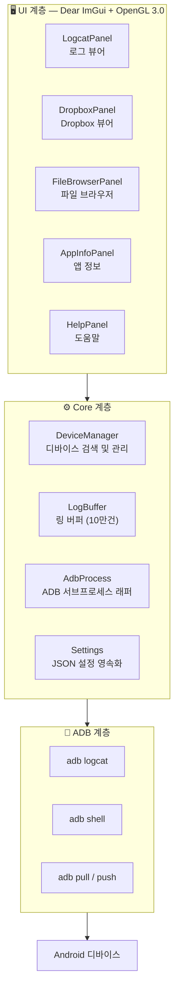

[English](README.md) | [簡体中文](README.zh-Hans.md) | [繁體中文](README.zh-Hant.md) | [日本語](README.ja.md) | **한국어** | [Русский](README.ru.md) | [Português (BR)](README.pt-BR.md)

<p align="center">
  
</p>

<h1 align="center">LogCater</h1>

<p align="center">
  <b>Android 디바이스 로그 및 파일 관리 데스크톱 도구</b>
</p>

<p align="center">
  <a href="../../releases"></a>
  <a href="../../releases"></a>
  <a href="LICENSE"></a>
  
  
  <a href="../../stargazers"></a>
</p>

---

## 목차

- [소개](#소개)
- [기능](#기능)
  - [실시간 Logcat](#실시간-logcat)
  - [Dropbox 뷰어](#dropbox-뷰어)
  - [파일 브라우저](#파일-브라우저)
  - [앱 정보](#앱-정보)
  - [프로세스 이름 매핑](#프로세스-이름-매핑)
  - [전역 UI 줌](#전역-ui-줌)
  - [자동 업데이트 확인](#자동-업데이트-확인)
- [다운로드 및 설치](#다운로드-및-설치)
- [소스에서 빌드](#소스에서-빌드)
- [아키텍처 개요](#아키텍처-개요)
- [단축키](#단축키)
- [FAQ](#faq)
- [기여하기](#기여하기)
- [감사의 말](#감사의-말)
- [라이선스](#라이선스)

## 소개

LogCater는 Android 개발자를 위한 Windows 데스크톱 도구로, 디바이스 로그 확인, 파일 관리, 앱 정보 검색을 하나의 도구에서 제공합니다.

- **제로 의존성 실행** — Android SDK, JDK 불필요. ADB는 릴리스 패키지에 포함
- **실시간 스트리밍 로그** — 지속적인 `adb logcat` 연결, 텍스트 / Tag / Level 3차원 필터 제공
- **경량 고성능** — Dear ImGui + OpenGL 3.0 기반, 빠른 실행, 낮은 메모리 사용량, 가상 스크롤로 대량 로그 처리
- **완전한 오픈소스** — MIT 라이선스, 투명한 코드

## 기능

### 실시간 Logcat

`adb logcat -v threadtime` 출력을 스트리밍하여 **텍스트 키워드**, **Tag**, **Level** 3차원 필터를 제공합니다. Tag 입력 이력이 자동 저장되며 필터 설정은 세션 간에 유지됩니다.

- 자동 스크롤 / 수동 스크롤 / 일시정지 / 재개
- 로그 라인 클릭 시 상세 정보 패널 표시 (타임스탬프, PID, TID, Tag, 원본 로그)
- 프로세스 이름 자동 매핑
- 로그 레벨별 컬러 식별자

### Dropbox 뷰어

디바이스의 `dumpsys dropbox` 엔트리(크래시 보고서, ANR, WTF 등)를 열람합니다.

- 유형별 필터 (System / Data / Crash)
- 클릭 시 상세 팝업
- 원클릭 로컬 파일 내보내기

### 파일 브라우저

데스크톱에서 벗어나지 않고 디바이스 파일을 완벽하게 관리합니다.

- 패키지 선택기로 앱 프라이빗 디렉터리로 빠르게 이동
- 빠른 탐색: `/sdcard`, 앱 데이터 디렉터리, `files`, `cache`
- **업로드** — Windows 탐색기에서 파일을 드래그 앤 드롭하여 디바이스로 전송
- **다운로드** — 버튼 클릭으로 로컬에 파일 저장
- **미리보기** — logcat / UE4 로그 구문 강조 지원
- **즐겨찾기** — 최대 20개 디렉터리 즐겨찾기 (세션 간 유지)

### 앱 정보

설치된 앱의 상세 정보를 표시합니다.

- 서드파티 / 시스템 / 전체 3가지 필터 모드
- 테이블 표시: 앱 이름, 패키지 이름, 버전 이름, 버전 코드, Target SDK
- 행 클릭 시 패키지 이름 클립보드 복사
- 패키지 이름 또는 앱 이름으로 검색 가능

### 프로세스 이름 매핑

로그 라인의 PID가 자동으로 해당 프로세스 이름으로 해석됩니다. 수동 `ps | grep`이 필요하지 않습니다.

### 전역 UI 줌

Ctrl + 마우스 휠, Ctrl + 0/+/- 로 실시간 확대/축소 지원. 배율은 `%APPDATA%\LogCater\settings.json`에 저장되며 다음 실행 시 자동 복원됩니다.

### 자동 업데이트 확인

실행 시 GitHub Releases에 자동으로 확인하여 새 버전이 있는지 감지합니다.

## 다운로드 및 설치

[Releases](../../releases) 페이지에서 최신 `LogCater.zip`을 다운로드하여 임의의 디렉터리에 압축을 풀고 `logcater.exe`를 실행하세요. ADB가 포함되어 있어 추가 설치가 필요 없습니다.

> ⚠️ **Windows Defender 오탐지 안내**
>
> LogCater는 **완전한 오픈소스이며 악성 코드가 전혀 포함되어 있지 않습니다**. 코드 서명이 되어 있지 않아 Windows Defender가 의심스러운 프로그램으로 표시할 수 있습니다.
>
> **해결 방법:**
> - Windows Defender에서 `logcater.exe`를 제외 목록에 추가
> - 또는 [소스에서 직접 빌드](#소스에서-빌드) (서명되지 않은 자체 빌드는 일반적으로 플래그되지 않음)

## 소스에서 빌드

### 사전 요구사항

| 도구 | 버전 |
|---|---|
| Visual Studio (MSVC) | 2022+ |
| CMake | 3.21+ |
| Git | 무관 |

### 의존성

모든 서드파티 라이브러리는 CMake `FetchContent`를 통해 자동 다운로드됩니다. **수동 설치 불필요**:

| 라이브러리 | 버전 | 용도 |
|---|---|---|
| [GLFW](https://github.com/glfw/glfw) | 3.4 | 윈도우 관리, OpenGL 컨텍스트 |
| [Dear ImGui](https://github.com/ocornut/imgui) | v1.91.9 | 즉시 모드 GUI |
| [nlohmann/json](https://github.com/nlohmann/json) | v3.11.3 | JSON 파싱 (설정 영속화용) |

### 컴파일

```bash
cmake -B build -DCMAKE_BUILD_TYPE=Release
cmake --build build --config Release
```

또는 저장소 루트의 `go.bat`을 실행하세요 (MSVC 환경을 자동으로 설정하고 빌드합니다).

## 아키텍처 개요



모든 ADB 통신은 백그라운드 스레드에서 실행되며, UI 스레드는 매 프레임 완료 상태를 폴링하여 UI가 항상 응답성을 유지합니다.

`LogBuffer`는 읽기/쓰기 잠금으로 보호되어, 높은 빈도의 쓰기(logcat 스트림)와 읽기(필터 새로고침)를 동시에 처리할 수 있습니다.

## 단축키

| 단축키 | 기능 |
|---|---|
| Ctrl + 휠 위 | UI 확대 |
| Ctrl + 휠 아래 | UI 축소 |
| Ctrl + = | UI 확대 |
| Ctrl + - | UI 축소 |
| Ctrl + 0 | 줌 100%로 초기화 |
| Space | 로그 스크롤 일시정지 / 재개 |
| Home | 로그 최상단으로 이동 |
| End | 로그 최하단으로 이동 |

## FAQ

<details>
<summary><b>ADB가 디바이스에 연결되지 않아요</b></summary>

1. 스마트폰에서 **USB 디버깅**이 활성화되어 있는지 확인 (개발자 옵션 내)
2. USB 케이블이 데이터 전송을 지원하는지 확인 (충전 전용 케이블이 아닌지)
3. 터미널에서 `adb devices`를 실행하여 디바이스 인식 상태 확인
4. USB를 다시 연결하거나 `adb kill-server && adb start-server` 실행
</details>

<details>
<summary><b>Logcat 로그가 깨져 보이거나 불완전해요</b></summary>

일부 제조사 ROM은 logcat에 비표준 인코딩 문자를 출력할 수 있습니다. LogCater는 UTF-8로 로그 라인을 파싱하며 디코딩할 수 없는 문자는 건너뜁니다. 정상적인 로그 표시에는 영향을 주지 않습니다.
</details>

<details>
<summary><b>Windows Defender가 바이러스로 표시하는 이유는?</b></summary>

LogCater는 고가의 코드 서명 인증서(보통 연간 $200-400)를 구매하지 않았습니다. Windows Defender는 서명되지 않은 새 프로그램에 대해 '의심스러우면 차단' 전략을 취합니다. 소스에서 빌드한 프로그램은 일반적으로 플래그되지 않습니다. Defender가 소스 빌드 행위를 합법적인 것으로 간주하기 때문입니다.

자세한 내용은 [다운로드 및 설치](#다운로드-및-설치)의 해결 방법을 참조하세요.
</details>

<details>
<summary><b>ADB 경로를 사용자 지정하려면?</b></summary>

시스템에 Android SDK가 설치된 경우 LogCater는 `%LOCALAPPDATA%\Android\Sdk\platform-tools\adb.exe`를 자동 감지합니다. 수동으로 지정하려면 `%APPDATA%\LogCater\settings.json`의 `adbPath` 필드를 편집하세요.
</details>

## 기여하기

버그 신고, 기능 제안 Issue 및 PR을 환영합니다.

1. 이 저장소를 Fork
2. 기능 브랜치 생성 (`git checkout -b feature/amazing-feature`)
3. 변경사항 커밋 (`git commit -m 'Add amazing feature'`)
4. 브랜치에 푸시 (`git push origin feature/amazing-feature`)
5. Pull Request 생성

기여 방향:
- macOS / Linux 크로스 플랫폼 지원
- Android LogID 지원 (Android 15+ 신규 로그 형식)
- CSV / JSON 형식 로그 내보내기

## 감사의 말

LogCater는 다음과 같은 뛰어난 오픈소스 프로젝트 위에 구축되었습니다:

- [Dear ImGui](https://github.com/ocornut/imgui) — 고효율 즉시 모드 GUI 프레임워크
- [GLFW](https://github.com/glfw/glfw) — 크로스 플랫폼 OpenGL 윈도우 라이브러리
- [nlohmann/json](https://github.com/nlohmann/json) — 모던 C++ JSON 라이브러리
- [Google platform-tools](https://developer.android.com/tools/releases/platform-tools) — Android Debug Bridge

## 라이선스

[MIT](LICENSE) © kefengwei
