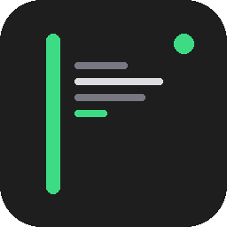
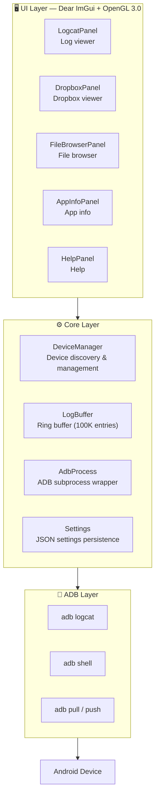

**English** | [简体中文](README.zh-Hans.md) | [繁體中文](README.zh-Hant.md) | [日本語](README.ja.md) | [한국어](README.ko.md) | [Русский](README.ru.md) | [Português (BR)](README.pt-BR.md)

<p align="center">
  
</p>

<h1 align="center">LogCater</h1>

<p align="center">
  <b>Android device log &amp; file management desktop tool</b>
</p>

<p align="center">
  <a href="../../releases"></a>
  <a href="../../releases"></a>
  <a href="LICENSE"></a>
  
  
  <a href="../../stargazers"></a>
</p>

---

## Table of Contents

- [Overview](#overview)
- [Features](#features)
  - [Real-time Logcat](#real-time-logcat)
  - [Dropbox Viewer](#dropbox-viewer)
  - [File Browser](#file-browser)
  - [App Info](#app-info)
  - [Process Name Mapping](#process-name-mapping)
  - [Global UI Zoom](#global-ui-zoom)
  - [Auto Update Check](#auto-update-check)
- [Download &amp; Install](#download--install)
- [Build from Source](#build-from-source)
- [Architecture Overview](#architecture-overview)
- [Keyboard Shortcuts](#keyboard-shortcuts)
- [FAQ](#faq)
- [Contributing](#contributing)
- [Acknowledgments](#acknowledgments)
- [License](#license)

## Overview

LogCater is a Windows desktop tool that gives Android developers a single pane of glass for viewing device logs, managing files, and browsing installed app details.

- **Zero runtime dependencies** — Android SDK and JDK not required. ADB is bundled in the release package
- **Real-time streaming** — Persistent `adb logcat` connection with text / tag / level three-dimensional filtering
- **Lightweight &amp; performant** — Built with Dear ImGui + OpenGL 3.0. Fast startup, low memory footprint, virtual scrolling for massive log volumes
- **Fully open source** — MIT licensed, transparent code, build it yourself

## Features

### Real-time Logcat

Streams `adb logcat -v threadtime` output with **keyword**, **tag**, and **level** filters. Tag input history is saved automatically, and filter preferences persist across sessions.

- Auto-scroll / manual scroll / pause / resume
- Click any log line to open a detail panel (timestamp, PID, TID, tag, full raw line)
- Inline process name resolution next to each PID
- Color-coded level indicators at a glance

### Dropbox Viewer

Browse `dumpsys dropbox` entries on the device — crash reports, ANRs, WTFs, and more.

- Filter by type (System / Data / Crash)
- Click to view full entry content in a popup
- One-click export to local file

### File Browser

Full device file management without leaving the desktop.

- Package selector for quick navigation to app private directories
- Quick-nav paths: `/sdcard`, app data dir, `files`, `cache`
- **Upload** — drag &amp; drop files from Windows Explorer onto the window
- **Download** — pull files to local disk with a click
- **Preview** — built-in file viewer with logcat / UE4 log syntax highlighting
- **Bookmarks** — up to 20 directory bookmarks persisted across sessions

### App Info

View detailed information about installed applications.

- Three filter modes: third-party / system / all
- Table columns: app name, package, version name, version code, target SDK
- Click a row to copy the package name to clipboard
- Search by package name or app label

### Process Name Mapping

PIDs in log lines are automatically resolved to human-readable process names — no more manual `ps | grep`.

### Global UI Zoom

Zoom the entire UI in real time: Ctrl + mouse wheel, Ctrl + 0/+/-. The zoom factor is persisted to `%APPDATA%\LogCater\settings.json` and restored on next launch.

### Auto Update Check

On startup, the app queries the GitHub Releases API to check for newer versions.

## Download &amp; Install

Grab the latest `LogCater.zip` from the [Releases](../../releases) page, extract anywhere, and run `logcater.exe`. ADB is included — no extra setup needed.

> ⚠️ **Windows Defender False Positive**
>
> LogCater is **fully open-source and contains no malicious code**. Because it is not code-signed, Windows Defender may flag it as suspicious. This is common for unsigned niche software.
>
> **Workarounds:**
> - Add `logcater.exe` to your Windows Defender exclusions
> - Or [build from source](#build-from-source) — self-built, unsigned binaries are usually not flagged

## Build from Source

### Prerequisites

| Tool | Version |
|---|---|
| Visual Studio (MSVC) | 2022+ |
| CMake | 3.21+ |
| Git | any |

### Dependencies

All third-party libraries are fetched automatically via CMake `FetchContent`. **No manual installation required**:

| Library | Version | Purpose |
|---|---|---|
| [GLFW](https://github.com/glfw/glfw) | 3.4 | Window management, OpenGL context |
| [Dear ImGui](https://github.com/ocornut/imgui) | v1.91.9 | Immediate-mode GUI |
| [nlohmann/json](https://github.com/nlohmann/json) | v3.11.3 | JSON parsing for settings persistence |

### Compile

```bash
cmake -B build -DCMAKE_BUILD_TYPE=Release
cmake --build build --config Release
```

Or run `go.bat` at the repository root — it auto-configures the MSVC environment and builds.

## Architecture Overview



All ADB communication runs on background threads. The UI thread polls completion status each frame, keeping the interface responsive at all times.

`LogBuffer` is guarded by a read-write lock, supporting concurrent high-frequency writes (logcat stream) and reads (filter refresh).

## Keyboard Shortcuts

| Shortcut | Action |
|---|---|
| Ctrl + Scroll Up | Zoom in |
| Ctrl + Scroll Down | Zoom out |
| Ctrl + = | Zoom in |
| Ctrl + - | Zoom out |
| Ctrl + 0 | Reset zoom to 100% |
| Space | Pause / resume log scrolling |
| Home | Jump to log top |
| End | Jump to log bottom |

## FAQ

<details>
<summary><b>ADB won't connect to my device?</b></summary>

1. Make sure **USB Debugging** is enabled (in Developer Options)
2. Verify your USB cable supports data transfer (not charge-only)
3. Run `adb devices` in a terminal to check device recognition status
4. Try re-plugging the USB cable or run `adb kill-server && adb start-server`
</details>

<details>
<summary><b>Logcat output shows garbled or incomplete text?</b></summary>

Some vendor ROMs may emit non-standard-encoding characters in logcat. LogCater parses log lines as UTF-8 and skips undecodable characters without affecting normal log display.
</details>

<details>
<summary><b>Why does Windows Defender flag this as a virus?</b></summary>

LogCater lacks an expensive code-signing certificate (typically $200–400/year). Windows Defender takes a "better safe than sorry" approach to new unsigned programs. Self-built binaries are usually not flagged, as Defender considers building from source a legitimate activity.

See [Download &amp; Install](#download--install) for workarounds.
</details>

<details>
<summary><b>How do I use a custom ADB path?</b></summary>

If Android SDK is installed, LogCater auto-detects `%LOCALAPPDATA%\Android\Sdk\platform-tools\adb.exe`. To override manually, edit the `adbPath` field in `%APPDATA%\LogCater\settings.json`.
</details>

## Contributing

Bug reports, feature suggestions, and pull requests are welcome.

1. Fork the repo
2. Create a feature branch (`git checkout -b feature/amazing-feature`)
3. Commit your changes (`git commit -m 'Add amazing feature'`)
4. Push to the branch (`git push origin feature/amazing-feature`)
5. Open a Pull Request

Potential contribution areas:
- Cross-platform support for macOS / Linux
- Android LogID support (new log format in Android 15+)
- Log export in CSV / JSON formats

## Acknowledgments

LogCater is built on these excellent open-source projects:

- [Dear ImGui](https://github.com/ocornut/imgui) — Bloat-free immediate-mode GUI framework
- [GLFW](https://github.com/glfw/glfw) — Cross-platform OpenGL window library
- [nlohmann/json](https://github.com/nlohmann/json) — Modern C++ JSON library
- [Google platform-tools](https://developer.android.com/tools/releases/platform-tools) — Android Debug Bridge

## License

[MIT](LICENSE) © kefengwei
