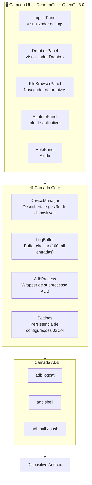

[English](README.md) | [簡体中文](README.zh-Hans.md) | [繁體中文](README.zh-Hant.md) | [日本語](README.ja.md) | [한국어](README.ko.md) | [Русский](README.ru.md) | **Português (BR)**

<p align="center">
  
</p>

<h1 align="center">LogCater</h1>

<p align="center">
  <b>Ferramenta desktop para gerenciamento de logs e arquivos de dispositivos Android</b>
</p>

<p align="center">
  <a href="../../releases"></a>
  <a href="../../releases"></a>
  <a href="LICENSE"></a>
  
  
  <a href="../../stargazers"></a>
</p>

---

## Índice

- [Visão Geral](#visão-geral)
- [Funcionalidades](#funcionalidades)
  - [Logcat em Tempo Real](#logcat-em-tempo-real)
  - [Visualizador de Dropbox](#visualizador-de-dropbox)
  - [Navegador de Arquivos](#navegador-de-arquivos)
  - [Informações de Aplicativos](#informações-de-aplicativos)
  - [Mapeamento de Nomes de Processos](#mapeamento-de-nomes-de-processos)
  - [Zoom Global da UI](#zoom-global-da-ui)
  - [Verificação Automática de Atualizações](#verificação-automática-de-atualizações)
- [Download e Instalação](#download-e-instalação)
- [Compilando a Partir do Código-Fonte](#compilando-a-partir-do-código-fonte)
- [Visão Geral da Arquitetura](#visão-geral-da-arquitetura)
- [Atalhos](#atalhos)
- [Perguntas Frequentes](#perguntas-frequentes)
- [Contribuindo](#contribuindo)
- [Agradecimentos](#agradecimentos)
- [Licença](#licença)

## Visão Geral

LogCater é uma ferramenta desktop para Windows que oferece aos desenvolvedores Android uma experiência unificada para visualização de logs, gerenciamento de arquivos e informações de aplicativos do dispositivo.

- **Zero dependências** — Não requer Android SDK ou JDK. O ADB está incluído no pacote de distribuição
- **Streaming de logs em tempo real** — Conexão persistente com `adb logcat`, com filtro tridimensional: texto / Tag / Level
- **Leve e performático** — Construído com Dear ImGui + OpenGL 3.0, inicialização rápida, baixo uso de memória, rolagem virtual para grandes volumes de logs
- **Código totalmente aberto** — Licença MIT, código transparente

## Funcionalidades

### Logcat em Tempo Real

Captura em streaming da saída do `adb logcat -v threadtime` com filtros por **palavras-chave**, **Tag** e **Level**. O histórico de tags é salvo automaticamente e as preferências de filtro persistem entre sessões.

- Rolagem automática / manual / pausar / retomar
- Clique em qualquer linha de log para abrir o painel de detalhes (timestamp, PID, TID, Tag, linha bruta completa)
- Nome do processo exibido inline ao lado do PID
- Identificadores coloridos por nível de log

### Visualizador de Dropbox

Navegue pelas entradas do `dumpsys dropbox` do dispositivo (relatórios de crash, ANR, WTF, etc.).

- Filtro por tipo (System / Data / Crash)
- Popup de detalhes ao clicar
- Exportar para arquivo local com um clique

### Navegador de Arquivos

Gerenciamento completo de arquivos do dispositivo sem sair da área de trabalho.

- Seletor de pacotes para navegação rápida aos diretórios privados do app
- Navegação rápida: `/sdcard`, diretório de dados do app, `files`, `cache`
- **Upload** — arraste arquivos do Explorador de Arquivos do Windows para o app
- **Download** — botão para baixar arquivos para o disco local
- **Pré-visualização** — visualizador integrado com destaque de sintaxe para logs logcat / UE4
- **Favoritos** — até 20 favoritos de diretórios (persistem entre sessões)

### Informações de Aplicativos

Visualize informações detalhadas dos aplicativos instalados.

- Três modos de filtro: apps de terceiros / sistema / todos
- Tabela: nome do app, pacote, versão, código de versão, Target SDK
- Clique na linha para copiar o nome do pacote para a área de transferência
- Pesquisa por nome de pacote ou nome do aplicativo

### Mapeamento de Nomes de Processos

O PID nas linhas de log é automaticamente resolvido para o nome do processo correspondente. Chega de `ps | grep` manual.

### Zoom Global da UI

Suporte a zoom em tempo real via Ctrl + roda do mouse, Ctrl + 0/+/-. A escala é salva em `%APPDATA%\LogCater\settings.json` e restaurada automaticamente na próxima execução.

### Verificação Automática de Atualizações

Ao iniciar, o app consulta automaticamente o GitHub Releases para verificar se há uma nova versão disponível.

## Download e Instalação

Baixe a versão mais recente do `LogCater.zip` na página de [Releases](../../releases), extraia em qualquer diretório e execute `logcater.exe`. O ADB já está incluído, sem necessidade de instalação adicional.

> ⚠️ **Falso Positivo do Windows Defender**
>
> O LogCater é **totalmente open-source e não contém código malicioso**. Por não possuir assinatura digital, o Windows Defender pode sinalizá-lo como suspeito.
>
> **Solução:**
> - Adicione o `logcater.exe` à lista de exclusões do Windows Defender
> - Ou [compile a partir do código-fonte](#compilando-a-partir-do-código-fonte) (builds próprios não assinados geralmente não são sinalizados)

## Compilando a Partir do Código-Fonte

### Pré-requisitos

| Ferramenta | Versão |
|---|---|
| Visual Studio (MSVC) | 2022+ |
| CMake | 3.21+ |
| Git | qualquer |

### Dependências

Todas as bibliotecas de terceiros são baixadas automaticamente via CMake `FetchContent`. **Nenhuma instalação manual necessária**:

| Biblioteca | Versão | Finalidade |
|---|---|---|
| [GLFW](https://github.com/glfw/glfw) | 3.4 | Gerenciamento de janelas, contexto OpenGL |
| [Dear ImGui](https://github.com/ocornut/imgui) | v1.91.9 | GUI de modo imediato (immediate mode) |
| [nlohmann/json](https://github.com/nlohmann/json) | v3.11.3 | Parse JSON, persistência de configurações |

### Compilação

```bash
cmake -B build -DCMAKE_BUILD_TYPE=Release
cmake --build build --config Release
```

Ou execute `go.bat` na raiz do repositório (configura automaticamente o ambiente MSVC e compila).

## Visão Geral da Arquitetura



Toda a comunicação com o ADB é executada em threads em segundo plano. A thread de UI consulta o status de conclusão a cada frame, garantindo que a interface permaneça sempre responsiva.

O `LogBuffer` é protegido por bloqueio de leitura/escrita, permitindo acesso concorrente de alta frequência para escrita (stream logcat) e leitura (atualização de filtros).

## Atalhos

| Atalho | Ação |
|---|---|
| Ctrl + Roda para cima | Aumentar zoom da UI |
| Ctrl + Roda para baixo | Diminuir zoom da UI |
| Ctrl + = | Aumentar zoom |
| Ctrl + - | Diminuir zoom |
| Ctrl + 0 | Redefinir zoom para 100% |
| Space | Pausar / retomar rolagem de logs |
| Home | Ir para o topo dos logs |
| End | Ir para o final dos logs |

## Perguntas Frequentes

<details>
<summary><b>O ADB não conecta ao dispositivo?</b></summary>

1. Verifique se a **Depuração USB** está ativada (nas Opções do Desenvolvedor)
2. Confirme que o cabo USB suporta transferência de dados (não apenas carregamento)
3. Execute `adb devices` no terminal para verificar o status de reconhecimento
4. Tente reconectar o USB ou execute `adb kill-server && adb start-server`
</details>

<details>
<summary><b>Os logs aparecem com caracteres estranhos ou incompletos?</b></summary>

Algumas ROMs de fabricantes podem emitir caracteres com codificação não padrão no logcat. O LogCater faz o parse das linhas como UTF-8 e ignora caracteres não decodificáveis, sem afetar a exibição dos logs normais.
</details>

<details>
<summary><b>Por que o Windows Defender marca como vírus?</b></summary>

O LogCater não possui um certificado de assinatura de código (que custa tipicamente $200-400/ano). O Windows Defender adota uma estratégia de "melhor prevenir do que remediar" para programas novos não assinados. Programas compilados a partir do código-fonte geralmente não são sinalizados, pois o Defender considera a compilação local como legítima.

Veja mais detalhes na seção [Download e Instalação](#download-e-instalação).
</details>

<details>
<summary><b>Como especificar um caminho personalizado para o ADB?</b></summary>

Se o Android SDK estiver instalado no sistema, o LogCater detectará automaticamente `%LOCALAPPDATA%\Android\Sdk\platform-tools\adb.exe`. Para especificar manualmente, edite o campo `adbPath` em `%APPDATA%\LogCater\settings.json`.
</details>

## Contribuindo

Issues com relatórios de bugs, sugestões de funcionalidades e Pull Requests são bem-vindos.

1. Faça um Fork deste repositório
2. Crie uma branch para sua feature (`git checkout -b feature/funcionalidade-incrivel`)
3. Faça o commit das alterações (`git commit -m 'Adiciona funcionalidade incrível'`)
4. Envie a branch (`git push origin feature/funcionalidade-incrivel`)
5. Abra um Pull Request

Possíveis direções de contribuição:
- Suporte multiplataforma macOS / Linux
- Suporte ao Android LogID (novo formato de log do Android 15+)
- Exportação de logs nos formatos CSV / JSON

## Agradecimentos

O LogCater é construído sobre estes excelentes projetos open-source:

- [Dear ImGui](https://github.com/ocornut/imgui) — Framework GUI de modo imediato de alta eficiência
- [GLFW](https://github.com/glfw/glfw) — Biblioteca multiplataforma de janelas OpenGL
- [nlohmann/json](https://github.com/nlohmann/json) — Biblioteca JSON moderna para C++
- [Google platform-tools](https://developer.android.com/tools/releases/platform-tools) — Android Debug Bridge

## Licença

[MIT](LICENSE) © kefengwei
