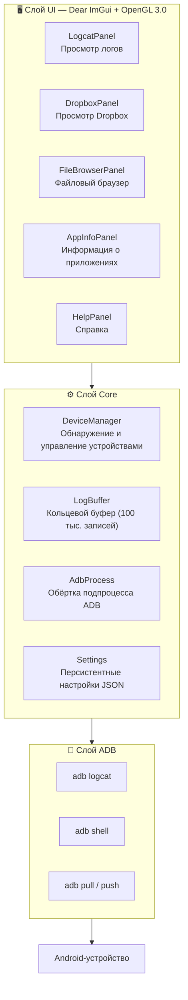

[English](README.md) | [簡体中文](README.zh-Hans.md) | [繁體中文](README.zh-Hant.md) | [日本語](README.ja.md) | [한국어](README.ko.md) | **Русский** | [Português (BR)](README.pt-BR.md)

<p align="center">
  
</p>

<h1 align="center">LogCater</h1>

<p align="center">
  <b>Инструмент для управления логами и файлами Android-устройств</b>
</p>

<p align="center">
  <a href="../../releases"></a>
  <a href="../../releases"></a>
  <a href="LICENSE"></a>
  
  
  <a href="../../stargazers"></a>
</p>

---

## Содержание

- [Обзор](#обзор)
- [Возможности](#возможности)
  - [Logcat в реальном времени](#logcat-в-реальном-времени)
  - [Просмотр Dropbox](#просмотр-dropbox)
  - [Файловый браузер](#файловый-браузер)
  - [Информация о приложениях](#информация-о-приложениях)
  - [Сопоставление имён процессов](#сопоставление-имён-процессов)
  - [Масштабирование интерфейса](#масштабирование-интерфейса)
  - [Автоматическая проверка обновлений](#автоматическая-проверка-обновлений)
- [Загрузка и установка](#загрузка-и-установка)
- [Сборка из исходников](#сборка-из-исходников)
- [Обзор архитектуры](#обзор-архитектуры)
- [Горячие клавиши](#горячие-клавиши)
- [Частые вопросы](#частые-вопросы)
- [Участие в разработке](#участие-в-разработке)
- [Благодарности](#благодарности)
- [Лицензия](#лицензия)

## Обзор

LogCater — это десктопное приложение для Windows, предоставляющее Android-разработчикам единый инструмент для просмотра логов, управления файлами и получения информации о приложениях на устройстве.

- **Нулевые зависимости** — Не требует установки Android SDK или JDK. ADB включён в релизный пакет
- **Потоковая передача логов** — Постоянное подключение к `adb logcat` с трёхмерной фильтрацией: текст / Tag / Level
- **Лёгкий и производительный** — На базе Dear ImGui + OpenGL 3.0, быстрый запуск, низкое потребление памяти, виртуальная прокрутка для больших объёмов логов
- **Полностью открытый исходный код** — Лицензия MIT, код полностью прозрачен

## Возможности

### Logcat в реальном времени

Потоковый захват вывода `adb logcat -v threadtime` с фильтрацией по **ключевым словам**, **Tag** и **Level**. История тегов сохраняется автоматически, настройки фильтров персистентны между сессиями.

- Автопрокрутка / ручная прокрутка / пауза / возобновление
- Клик по строке лога открывает панель с деталями (время, PID, TID, Tag, полная исходная строка)
- Автоматическое отображение имени процесса рядом с PID
- Цветовая маркировка уровней логирования

### Просмотр Dropbox

Просмотр записей `dumpsys dropbox` на устройстве (отчёты о падениях, ANR, WTF и др.).

- Фильтрация по типу (System / Data / Crash)
- Клик для просмотра содержимого во всплывающем окне
- Экспорт в локальный файл в один клик

### Файловый браузер

Полноценное управление файлами устройства без выхода из приложения.

- Выбор пакета для быстрого перехода к приватной директории приложения
- Быстрая навигация: `/sdcard`, директория данных приложения, `files`, `cache`
- **Загрузка на устройство** — перетащите файл из Проводника Windows в окно приложения
- **Скачивание** — кнопка для сохранения файла на локальный диск
- **Предпросмотр** — встроенный просмотрщик с подсветкой синтаксиса logcat / UE4 логов
- **Закладки** — до 20 закладок на директории (сохраняются между сессиями)

### Информация о приложениях

Просмотр подробной информации об установленных приложениях.

- Три режима фильтрации: сторонние / системные / все
- Таблица: имя приложения, пакет, версия, код версии, Target SDK
- Клик по строке копирует имя пакета в буфер обмена
- Поиск по имени пакета или названию приложения

### Сопоставление имён процессов

PID в строках лога автоматически преобразуется в имя процесса. Больше не нужно вручную выполнять `ps | grep`.

### Масштабирование интерфейса

Поддержка масштабирования через Ctrl + колёсико мыши, Ctrl + 0/+/-. Масштаб сохраняется в `%APPDATA%\LogCater\settings.json` и автоматически восстанавливается при следующем запуске.

### Автоматическая проверка обновлений

При запуске приложение автоматически проверяет наличие новых версий через GitHub Releases API.

## Загрузка и установка

Скачайте последнюю версию `LogCater.zip` со страницы [Releases](../../releases), распакуйте в любую папку и запустите `logcater.exe`. ADB уже включён в пакет, дополнительная установка не требуется.

> ⚠️ **Ложное срабатывание Windows Defender**
>
> LogCater — **полностью открытое приложение, не содержащее вредоносного кода**. Из-за отсутствия цифровой подписи Windows Defender может пометить программу как подозрительную.
>
> **Решение:**
> - Добавьте `logcater.exe` в список исключений Windows Defender
> - Или [соберите из исходников](#сборка-из-исходников) (неподписанная самодельная сборка обычно не вызывает срабатывания)

## Сборка из исходников

### Требования

| Инструмент | Версия |
|---|---|
| Visual Studio (MSVC) | 2022+ |
| CMake | 3.21+ |
| Git | любая |

### Зависимости

Все сторонние библиотеки загружаются автоматически через CMake `FetchContent`. **Ручная установка не требуется**:

| Библиотека | Версия | Назначение |
|---|---|---|
| [GLFW](https://github.com/glfw/glfw) | 3.4 | Управление окнами, контекст OpenGL |
| [Dear ImGui](https://github.com/ocornut/imgui) | v1.91.9 | Immediate mode GUI |
| [nlohmann/json](https://github.com/nlohmann/json) | v3.11.3 | Парсинг JSON, сохранение настроек |

### Компиляция

```bash
cmake -B build -DCMAKE_BUILD_TYPE=Release
cmake --build build --config Release
```

Или запустите `go.bat` в корне репозитория (автоматически настраивает MSVC окружение и выполняет сборку).

## Обзор архитектуры



Всё взаимодействие с ADB выполняется в фоновых потоках. UI-поток опрашивает статус завершения каждый кадр, обеспечивая постоянную отзывчивость интерфейса.

`LogBuffer` защищён блокировкой чтения/записи, что позволяет одновременно выполнять высокочастотную запись (поток logcat) и чтение (обновление фильтров).

## Горячие клавиши

| Клавиши | Действие |
|---|---|
| Ctrl + Колёсико вверх | Увеличить интерфейс |
| Ctrl + Колёсико вниз | Уменьшить интерфейс |
| Ctrl + = | Увеличить интерфейс |
| Ctrl + - | Уменьшить интерфейс |
| Ctrl + 0 | Сбросить масштаб до 100% |
| Space | Пауза / возобновление прокрутки логов |
| Home | Перейти к началу логов |
| End | Перейти к концу логов |

## Частые вопросы

<details>
<summary><b>ADB не подключается к устройству?</b></summary>

1. Убедитесь, что **отладка по USB** включена (в параметрах разработчика)
2. Проверьте, что USB-кабель поддерживает передачу данных (не только зарядку)
3. Выполните `adb devices` в терминале для проверки статуса устройства
4. Попробуйте переподключить USB или выполнить `adb kill-server && adb start-server`
</details>

<details>
<summary><b>Логи отображаются некорректно или не полностью?</b></summary>

Некоторые производители ROM выводят в logcat символы в нестандартной кодировке. LogCater парсит строки как UTF-8 и пропускает нечитаемые символы, не влияя на отображение нормальных логов.
</details>

<details>
<summary><b>Почему Windows Defender помечает программу как вирус?</b></summary>

LogCater не имеет платного сертификата цифровой подписи (обычно $200-400/год). Windows Defender применяет стратегию «лучше перестраховаться» к неподписанным программам. Самостоятельно собранная программа обычно не вызывает срабатывания, так как Defender считает сборку из исходников легитимным действием.

Подробнее в разделе [Загрузка и установка](#загрузка-и-установка).
</details>

<details>
<summary><b>Как указать свой путь к ADB?</b></summary>

Если в системе установлен Android SDK, LogCater автоматически найдёт `%LOCALAPPDATA%\Android\Sdk\platform-tools\adb.exe`. Для ручного указания пути отредактируйте поле `adbPath` в `%APPDATA%\LogCater\settings.json`.
</details>

## Участие в разработке

Приветствуются Issue с баг-репортами, предложениями новых функций, а также Pull Request'ы.

1. Форкните репозиторий
2. Создайте ветку для фичи (`git checkout -b feature/amazing-feature`)
3. Зафиксируйте изменения (`git commit -m 'Add amazing feature'`)
4. Отправьте ветку (`git push origin feature/amazing-feature`)
5. Создайте Pull Request

Потенциальные направления развития:
- Кроссплатформенная поддержка macOS / Linux
- Поддержка Android LogID (новый формат логов Android 15+)
- Экспорт логов в CSV / JSON

## Благодарности

LogCater построен на основе следующих замечательных проектов:

- [Dear ImGui](https://github.com/ocornut/imgui) — высокоэффективный immediate mode GUI фреймворк
- [GLFW](https://github.com/glfw/glfw) — кроссплатформенная библиотека окон OpenGL
- [nlohmann/json](https://github.com/nlohmann/json) — современная C++ библиотека JSON
- [Google platform-tools](https://developer.android.com/tools/releases/platform-tools) — Android Debug Bridge

## Лицензия

[MIT](LICENSE) © kefengwei
