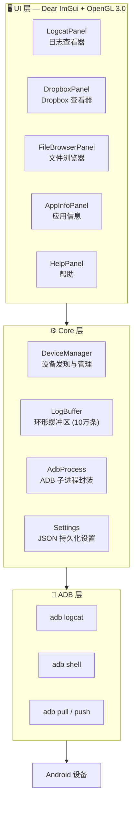

[English](README.md) | **简体中文** | [繁體中文](README.zh-Hant.md) | [日本語](README.ja.md) | [한국어](README.ko.md) | [Русский](README.ru.md) | [Português (BR)](README.pt-BR.md)

<p align="center">
  
</p>

<h1 align="center">LogCater</h1>

<p align="center">
  <b>Android 设备日志与文件管理桌面工具</b>
</p>

<p align="center">
  <a href="../../releases"></a>
  <a href="../../releases"></a>
  <a href="LICENSE"></a>
  
  
  <a href="../../stargazers"></a>
</p>

---

## 目录

- [简介](#简介)
- [功能](#功能)
  - [实时 Logcat](#实时-logcat)
  - [Dropbox 查看器](#dropbox-查看器)
  - [文件浏览器](#文件浏览器)
  - [应用信息](#应用信息)
  - [进程名映射](#进程名映射)
  - [全局 UI 缩放](#全局-ui-缩放)
  - [自动更新检查](#自动更新检查)
- [下载与安装](#下载与安装)
- [从源码构建](#从源码构建)
- [架构概述](#架构概述)
- [快捷键](#快捷键)
- [常见问题](#常见问题)
- [参与贡献](#参与贡献)
- [致谢](#致谢)
- [许可](#许可)

## 简介

LogCater 是一款 Windows 桌面工具，为 Android 开发者提供一体化的设备日志查看、文件管理和应用信息浏览体验。

- **零依赖运行** — 无需安装 Android SDK，无需配置 JDK，ADB 已内置于发布包中
- **实时流式日志** — 持久化 `adb logcat` 连接，支持文本 / Tag / Level 三维过滤
- **轻量高性能** — 基于 Dear ImGui + OpenGL 3.0 构建，启动快、内存占用低、支持虚拟滚动处理海量日志
- **完全开源** — MIT 协议，代码透明，可自行构建

## 功能

### 实时 Logcat

流式抓取 `adb logcat -v threadtime` 输出，支持 **文本关键字**、**Tag**、**Level** 三维过滤。Tag 输入框自动记录历史，过滤偏好持久保存。

- 自动滚动 / 手动滚动 / 暂停 / 恢复
- 点击任意日志行展开详情面板（时间戳、PID、TID、Tag、完整原始行）
- 行内自动关联进程名
- 彩色 Level 标识，一目了然

### Dropbox 查看器

浏览设备 `dumpsys dropbox` 中的系统条目（crash 报告、ANR、WTF 等）。

- 按类型筛选（System / Data / Crash）
- 点击查看完整内容弹窗
- 一键导出到本地文件

### 文件浏览器

完整的设备文件管理体验，无需离开桌面。

- 包名选择器快速跳转到应用私有目录
- 常用路径快捷导航：`/sdcard`、应用数据目录、`files`、`cache`
- **上传** — 从 Windows 资源管理器拖拽文件到窗口即可推送到设备
- **下载** — 右键或点击按钮拉取文件到本地
- **预览** — 内置文件预览，支持 logcat 日志和 UE4 日志语法高亮
- **书签** — 最多 20 个目录书签，跨会话保留

### 应用信息

查看已安装应用的详细信息。

- 支持三方应用 / 系统应用 / 全部三种筛选
- 表格展示：应用名、包名、版本名、版本号、Target SDK
- 点击行自动复制包名到剪贴板
- 支持按包名或应用名搜索

### 进程名映射

日志行中的 PID 自动解析为对应的进程名，无需手动 `ps | grep`。

### 全局 UI 缩放

支持 Ctrl + 滚轮、Ctrl + 0/+/- 实时缩放界面。缩放比例持久保存在 `%APPDATA%\LogCater\settings.json` 中，下次启动自动恢复。

### 自动更新检查

启动时自动向 GitHub Releases 发送请求，检测是否有新版本可用。

## 下载与安装

从 [Releases](../../releases) 页面下载最新 `LogCater.zip`，解压到任意目录，运行 `logcater.exe` 即可。发布包已内置 ADB，无需额外安装。

> ⚠️ **Windows Defender 误报说明**
>
> LogCater **完全开源，不含任何恶意代码**。由于未进行代码签名，Windows Defender 可能将程序标记为可疑。这在未签名的小众软件中是普遍现象。
>
> **解决方法：**
> - 在 Windows Defender 中将 `logcater.exe` 添加为排除项
> - 或[从源码自行编译](#从源码构建)（未签名的自编译程序通常不会被标记）

## 从源码构建

### 环境要求

| 工具 | 版本 |
|---|---|
| Visual Studio (MSVC) | 2022+ |
| CMake | 3.21+ |
| Git | 任意 |

### 依赖

所有第三方库通过 CMake `FetchContent` 自动下载，**无需手动安装**：

| 库 | 版本 | 用途 |
|---|---|---|
| [GLFW](https://github.com/glfw/glfw) | 3.4 | 窗口管理、OpenGL 上下文 |
| [Dear ImGui](https://github.com/ocornut/imgui) | v1.91.9 | 即时模式 GUI |
| [nlohmann/json](https://github.com/nlohmann/json) | v3.11.3 | JSON 解析，用于设置持久化 |

### 编译

```bash
cmake -B build -DCMAKE_BUILD_TYPE=Release
cmake --build build --config Release
```

或直接运行仓库根目录下的 `go.bat`（自动配置 MSVC 环境并构建）。

## 架构概述



所有 ADB 通信运行在后台线程中，UI 线程每帧轮询完成状态，确保界面始终流畅响应。

`LogBuffer` 采用读写锁保护，支持高频写入（logcat 流）与高频读取（过滤刷新）并发访问。

## 快捷键

| 快捷键 | 功能 |
|---|---|
| Ctrl + 滚轮上 | 放大 UI |
| Ctrl + 滚轮下 | 缩小 UI |
| Ctrl + = | 放大 UI |
| Ctrl + - | 缩小 UI |
| Ctrl + 0 | 重置缩放为 100% |
| Space | 暂停 / 恢复日志滚动 |
| Home | 跳转到日志顶部 |
| End | 跳转到日志底部 |

## 常见问题

<details>
<summary><b>ADB 连接不上设备？</b></summary>

1. 确认手机已开启 **USB 调试**（开发者选项中）
2. 确认 USB 数据线支持数据传输（非仅充电线）
3. 在终端中运行 `adb devices` 确认设备识别状态
4. 尝试重新插拔 USB 或执行 `adb kill-server && adb start-server`
</details>

<details>
<summary><b>Logcat 日志显示乱码或不完整？</b></summary>

部分厂商的 ROM 会在 logcat 中输出非标准编码字符。LogCater 以 UTF-8 解析日志行，遇到无法解码的字符会跳过，不影响正常日志的显示。
</details>

<details>
<summary><b>为什么会被 Windows Defender 标记为病毒？</b></summary>

LogCater 未购买昂贵的代码签名证书（价格通常为 $200-400/年）。Windows Defender 对未签名的新程序采取"宁可错杀"的策略。自编译的程序通常不会被标记，因为 Defender 认为从源码构建的行为具有合法性。

详见[下载与安装](#下载与安装)中的解决方案。
</details>

<details>
<summary><b>如何自定义 ADB 路径？</b></summary>

如果系统中已安装 Android SDK，LogCater 会自动检测 `%LOCALAPPDATA%\Android\Sdk\platform-tools\adb.exe`。如需手动指定，可在 `%APPDATA%\LogCater\settings.json` 中修改 `adbPath` 字段。
</details>

## 参与贡献

欢迎提交 Issue 报告 Bug 或建议新功能。PR 也欢迎直接提。

1. Fork 本仓库
2. 创建特性分支 (`git checkout -b feature/amazing-feature`)
3. 提交修改 (`git commit -m 'Add amazing feature'`)
4. 推送到分支 (`git push origin feature/amazing-feature`)
5. 创建 Pull Request

潜在贡献方向：
- macOS / Linux 跨平台支持
- Android LogID 支持（Android 15+ 新日志格式）
- 日志导出为 CSV / JSON 格式

## 致谢

LogCater 建立在以下优秀开源项目之上：

- [Dear ImGui](https://github.com/ocornut/imgui) — 高效的即时模式 GUI 框架
- [GLFW](https://github.com/glfw/glfw) — 跨平台 OpenGL 窗口库
- [nlohmann/json](https://github.com/nlohmann/json) — 现代 C++ JSON 库
- [Google platform-tools](https://developer.android.com/tools/releases/platform-tools) — Android Debug Bridge

## 许可

[MIT](LICENSE) © kefengwei
