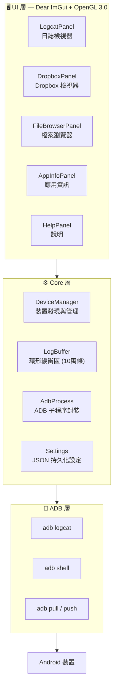

[English](README.md) | [簡體中文](README.zh-Hans.md) | **繁體中文** | [日本語](README.ja.md) | [한국어](README.ko.md) | [Русский](README.ru.md) | [Português (BR)](README.pt-BR.md)

<p align="center">
  
</p>

<h1 align="center">LogCater</h1>

<p align="center">
  <b>Android 裝置日誌與檔案管理桌面工具</b>
</p>

<p align="center">
  <a href="../../releases"></a>
  <a href="../../releases"></a>
  <a href="LICENSE"></a>
  
  
  <a href="../../stargazers"></a>
</p>

---

## 目錄

- [簡介](#簡介)
- [功能](#功能)
  - [即時 Logcat](#即時-logcat)
  - [Dropbox 檢視器](#dropbox-檢視器)
  - [檔案瀏覽器](#檔案瀏覽器)
  - [應用資訊](#應用資訊)
  - [處理程序名稱對應](#處理程序名稱對應)
  - [全域 UI 縮放](#全域-ui-縮放)
  - [自動更新檢查](#自動更新檢查)
- [下載與安裝](#下載與安裝)
- [從原始碼建置](#從原始碼建置)
- [架構概述](#架構概述)
- [快速鍵](#快速鍵)
- [常見問題](#常見問題)
- [參與貢獻](#參與貢獻)
- [致謝](#致謝)
- [授權條款](#授權條款)

## 簡介

LogCater 是一款 Windows 桌面工具，為 Android 開發者提供一體化的裝置日誌檢視、檔案管理和應用資訊瀏覽體驗。

- **零依賴執行** — 無需安裝 Android SDK、無需設定 JDK，ADB 已內建於發行包中
- **即時串流日誌** — 持久化 `adb logcat` 連線，支援文字 / Tag / Level 三維篩選
- **輕量高效能** — 基於 Dear ImGui + OpenGL 3.0 建構，啟動快、記憶體佔用低、支援虛擬捲動處理海量日誌
- **完全開放原始碼** — MIT 授權，程式碼透明，可自行建置

## 功能

### 即時 Logcat

串流擷取 `adb logcat -v threadtime` 輸出，支援**文字關鍵字**、**Tag**、**Level** 三維篩選。Tag 輸入框自動記錄歷史，篩選偏好持久儲存。

- 自動捲動 / 手動捲動 / 暫停 / 恢復
- 點選任意日誌行展開詳細資訊面板（時間戳記、PID、TID、Tag、完整原始行）
- 行內自動關聯處理程序名稱
- 彩色 Level 標識，一目瞭然

### Dropbox 檢視器

瀏覽裝置 `dumpsys dropbox` 中的系統條目（crash 報告、ANR、WTF 等）。

- 按類型篩選（System / Data / Crash）
- 點選檢視完整內容彈窗
- 一鍵匯出到本機檔案

### 檔案瀏覽器

完整的裝置檔案管理體驗，無需離開桌面。

- 套件名稱選擇器快速跳轉到應用私有目錄
- 常用路徑快速導覽：`/sdcard`、應用資料目錄、`files`、`cache`
- **上傳** — 從 Windows 檔案總管拖曳檔案到視窗即可推送至裝置
- **下載** — 點選按鈕拉取檔案到本機
- **預覽** — 內建檔案預覽，支援 logcat 日誌和 UE4 日誌語法突顯
- **書籤** — 最多 20 個目錄書籤，跨工作階段保留

### 應用資訊

檢視已安裝應用的詳細資訊。

- 支援第三方應用 / 系統應用 / 全部三種篩選模式
- 表格展示：應用名稱、套件名稱、版本名稱、版本代碼、Target SDK
- 點選行自動複製套件名稱到剪貼簿
- 支援按套件名稱或應用名稱搜尋

### 處理程序名稱對應

日誌行中的 PID 自動解析為對應的處理程序名稱，無需手動 `ps | grep`。

### 全域 UI 縮放

支援 Ctrl + 滾輪、Ctrl + 0/+/- 即時縮放介面。縮放比例持久儲存在 `%APPDATA%\LogCater\settings.json` 中，下次啟動自動還原。

### 自動更新檢查

啟動時自動向 GitHub Releases 傳送請求，偵測是否有新版本可用。

## 下載與安裝

從 [Releases](../../releases) 頁面下載最新 `LogCater.zip`，解壓縮到任意目錄，執行 `logcater.exe` 即可。發行包已內建 ADB，無需額外安裝。

> ⚠️ **Windows Defender 誤報說明**
>
> LogCater **完全開放原始碼，不含任何惡意程式碼**。由於未進行程式碼簽章，Windows Defender 可能將程式標記為可疑。這在未簽章的小眾軟體中是普遍現象。
>
> **解決方法：**
> - 在 Windows Defender 中將 `logcater.exe` 新增為排除項目
> - 或[從原始碼自行建置](#從原始碼建置)（未簽章的自建置程式通常不會被標記）

## 從原始碼建置

### 環境需求

| 工具 | 版本 |
|---|---|
| Visual Studio (MSVC) | 2022+ |
| CMake | 3.21+ |
| Git | 任意 |

### 相依性

所有第三方函式庫透過 CMake `FetchContent` 自動下載，**無需手動安裝**：

| 函式庫 | 版本 | 用途 |
|---|---|---|
| [GLFW](https://github.com/glfw/glfw) | 3.4 | 視窗管理、OpenGL 內容 |
| [Dear ImGui](https://github.com/ocornut/imgui) | v1.91.9 | 即時模式 GUI |
| [nlohmann/json](https://github.com/nlohmann/json) | v3.11.3 | JSON 解析，用於設定持久化 |

### 編譯

```bash
cmake -B build -DCMAKE_BUILD_TYPE=Release
cmake --build build --config Release
```

或直接執行儲存庫根目錄下的 `go.bat`（自動設定 MSVC 環境並建置）。

## 架構概述



所有 ADB 通訊在背景執行緒中執行，UI 執行緒每幀輪詢完成狀態，確保介面始終流暢回應。

`LogBuffer` 採用讀寫鎖保護，支援高頻寫入（logcat 串流）與高頻讀取（篩選刷新）並行存取。

## 快速鍵

| 快速鍵 | 功能 |
|---|---|
| Ctrl + 滾輪上 | 放大 UI |
| Ctrl + 滾輪下 | 縮小 UI |
| Ctrl + = | 放大 UI |
| Ctrl + - | 縮小 UI |
| Ctrl + 0 | 重設縮放為 100% |
| Space | 暫停 / 恢復日誌捲動 |
| Home | 跳轉到日誌頂部 |
| End | 跳轉到日誌底部 |

## 常見問題

<details>
<summary><b>ADB 連線不上裝置？</b></summary>

1. 確認手機已開啟 **USB 偵錯**（開發者選項中）
2. 確認 USB 傳輸線支援資料傳輸（非僅充電線）
3. 在終端機中執行 `adb devices` 確認裝置識別狀態
4. 嘗試重新插拔 USB 或執行 `adb kill-server && adb start-server`
</details>

<details>
<summary><b>Logcat 日誌顯示亂碼或不完整？</b></summary>

部分廠商的 ROM 會在 logcat 中輸出非標準編碼字元。LogCater 以 UTF-8 解析日誌行，遇到無法解碼的字元會跳過，不影響正常日誌的顯示。
</details>

<details>
<summary><b>為什麼會被 Windows Defender 標記為病毒？</b></summary>

LogCater 未購買昂貴的程式碼簽章憑證（價格通常為 $200-400/年）。Windows Defender 對未簽章的新程式採取「寧可誤報」的策略。自建置的程式通常不會被標記，因為 Defender 認為從原始碼建置的行為具有合法性。

詳見[下載與安裝](#下載與安裝)中的解決方案。
</details>

<details>
<summary><b>如何自訂 ADB 路徑？</b></summary>

如果系統中已安裝 Android SDK，LogCater 會自動偵測 `%LOCALAPPDATA%\Android\Sdk\platform-tools\adb.exe`。如需手動指定，可在 `%APPDATA%\LogCater\settings.json` 中修改 `adbPath` 欄位。
</details>

## 參與貢獻

歡迎提交 Issue 回報錯誤或建議新功能。也歡迎直接提交 PR。

1. Fork 本儲存庫
2. 建立特性分支 (`git checkout -b feature/amazing-feature`)
3. 提交修改 (`git commit -m 'Add amazing feature'`)
4. 推送到分支 (`git push origin feature/amazing-feature`)
5. 建立 Pull Request

潛在貢獻方向：
- macOS / Linux 跨平台支援
- Android LogID 支援（Android 15+ 新日誌格式）
- 日誌匯出為 CSV / JSON 格式

## 致謝

LogCater 建立在以下優秀開放原始碼專案之上：

- [Dear ImGui](https://github.com/ocornut/imgui) — 高效的即時模式 GUI 框架
- [GLFW](https://github.com/glfw/glfw) — 跨平台 OpenGL 視窗庫
- [nlohmann/json](https://github.com/nlohmann/json) — 現代 C++ JSON 庫
- [Google platform-tools](https://developer.android.com/tools/releases/platform-tools) — Android Debug Bridge

## 授權條款

[MIT](LICENSE) © kefengwei
